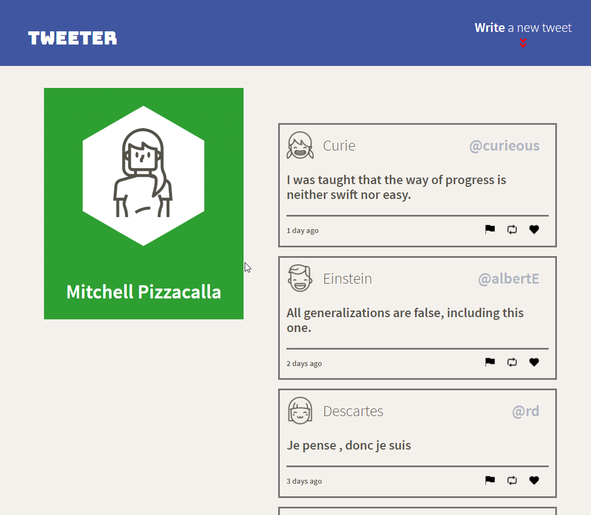
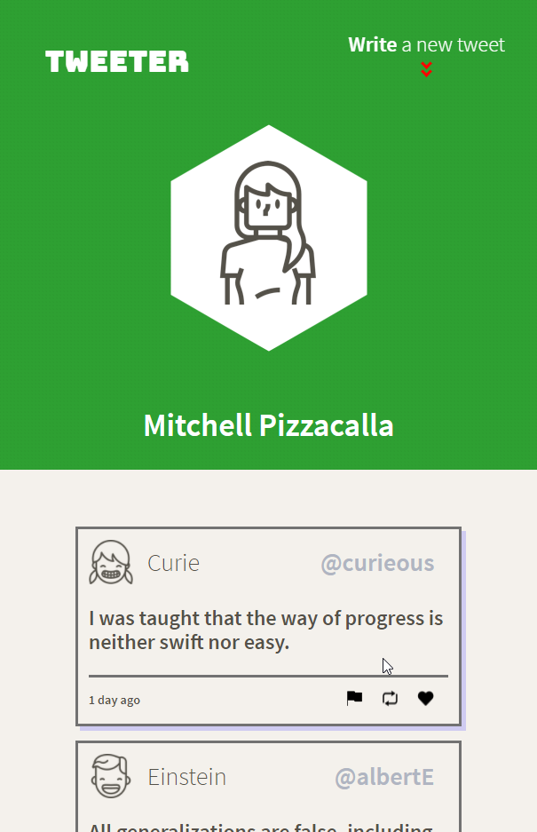
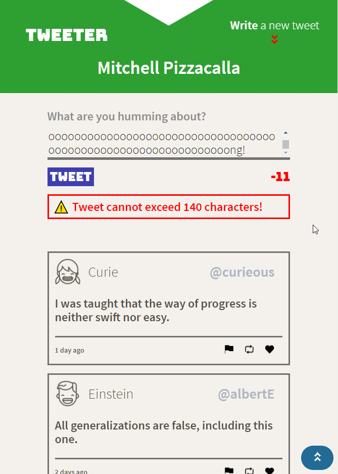

# Tweeter Project

Tweeter is a simple, single-page Twitter clone.

Made using HTML, CSS, JS, and jQuery.

## Getting Started

1. Install dependencies using the `npm install` command.
2. Start the web server using the `npm run local` command. The app will be served at <http://localhost:8080/>.
3. Go to <http://localhost:8080/> in your browser.

## Dependencies

- Express
- Node 5.10.x or above

## Screenshots

- Desktop Site

- Mobile Site

- Compose a Tweet

- Show Errors
